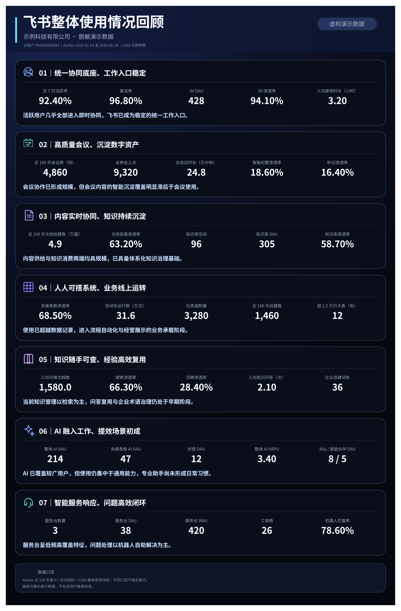

# Feishu Customer BR

一个用于生成“飞书整体使用情况回顾”的 TRAE Skill。它会识别客户主租户，读取 C360 最新快照，并在环境允许时补充 Aeolus 近 180 天数据，形成结构化洞见、飞书文档和数据画板。

> 当前版本：`2.6.3`



预览图中的公司、租户编号和数据均为虚构示例，不对应任何真实客户。

## 适用场景

当你需要完成以下工作时，可以调用本 Skill：

- 准备客户 Business Review；
- 复盘客户近 180 天飞书使用情况；
- 分析主租户的协同、内容、知识、AI 与服务台使用；
- 生成可直接放入飞书文档的数据洞察画板。

安装后，用户提到“回访”“BR”“Business Review”“客户复盘”“使用回顾”等相近意图时，TRAE 会自动匹配并调用本 Skill，无需显式输入 Skill 名称。

## 能力范围

Skill 会完成：

1. 识别客户及其主租户；
2. 从 C360 获取租户与最新使用指标；
3. 在增强模式下，从指定 Aeolus 看板读取近 180 天累计或日均指标；
4. 按七个模块整理数据并生成洞见；
5. 创建飞书整体使用情况回顾文档；
6. 创建并回读检查飞书画板。

## 两种运行模式

### C360 快照模式

适用于 Aily 智能伙伴、云端沙箱或无法访问 ByteDance 内网 Aeolus 的环境。

- 使用 C360 七模块最新使用指标；
- 正常生成正式回顾文档和画板；
- 口径明确标记为 `C360 最新使用快照`；
- 不展示近 180 天累计、日均、趋势或同比。

### C360 + Aeolus 增强模式

适用于可访问 Aeolus 的桌面环境，或用户提供 Aeolus 导出文件的情况。

- 安装在 TRAE、Codex 等环境时，只要模拟浏览器、内置浏览器或用户 Chrome 能访问 ByteDance 内网，就会自动操作 Aeolus 取数；
- 在 C360 快照基础上补充近 180 天累计和日均指标；
- 可补充紧邻前 180 天对比；
- 输出中标注明确的起止日期和数据来源。

七个模块包括：

- 即时协同
- 会议协同
- 内容沉淀
- 多维表格
- 知识管理
- AI 赋能
- 服务台

本 Skill 不负责案例推荐、服务计划、场景共创、交互卡片或会后自动更新。

## 前置依赖

运行前需要具备：

- TRAE 的自定义 Skill 能力；
- 可用的 `lark-c360` CLI；
- C360 查询权限；
- 飞书文档与画板的创建、读取和更新权限；

如需增强模式，还需要：

- Aeolus 看板访问权限及已登录的 ByteDance SSO 会话；
- 可访问 ByteDance 内网并操作 Aeolus 页面的浏览器，或用户提供 CSV/XLSX、完整截图、已确认指标表。

这些依赖包含内部数据源和权限。本仓库不会提供账号、凭据或真实客户数据。

## 安装

### 从 Release 安装

1. 打开仓库的 [Releases](https://github.com/yvwaiii/Feishu_Customer_BR/releases)；
2. 下载 `customer-business-review-skill.zip`；
3. 解压到工作区的 `.trae/skills/` 目录。

### Aily 智能伙伴

将 Skill 解压到 `~/.aily/workspace/skills/customer-business-review/`。首次运行时，Skill 会从 C360 官方 TOS 安装 CLI 到 `~/.aily/workspace`，不会访问公共 npm registry。

官方手动安装命令：

```bash
npm install -g \
  https://lf-ldic360.feishucdn.com/obj/ldi-c360/cli/lark-c360/latest/customer360-lark-c360.tgz \
  --prefix ~/.aily/workspace
export PATH="$HOME/.aily/workspace/bin:$PATH"
lark-c360 install-skills --force
```

Aily 的登录态、C360 skills 和持久化数据均保存在 `~/.aily/workspace`。`/home/gem/.aily/workdir/<task>/` 是任务临时目录，不应作为跨会话数据地址。

安装后的目录结构：

```text
.trae/skills/customer-business-review/
├── SKILL.md
├── README.md
└── references/
```

### 从源码安装

将仓库中的 `SKILL.md`、`README.md` 和 `references/` 复制到：

```text
.trae/skills/customer-business-review/
```

## 使用方法

安装后，用自然语言向 TRAE 提出客户使用回顾需求。例如：

```text
请为客户示例科技生成飞书整体使用情况回顾。
```

也可以直接提供主租户 F 码：

```text
请基于主租户 FXXXXXXXXXXX 生成近 180 天飞书使用回顾。
```

如果客户或主租户无法唯一确定，Skill 会先要求补充或确认，不会使用默认租户继续分析。

在 Aily 中调用时，Aeolus 无法访问不会阻塞任务。Skill 会自动生成 C360 快照版。若需要近 180 天趋势，可追加说明：

```text
请在我提供 Aeolus 导出后，将当前快照版升级为近 180 天增强版。
```

如果上一次任务给出了不可访问的 `/home/gem/.aily/workdir/...` 数据路径，新任务会先查 `~/.aily/workspace` 持久化副本；不存在时自动重新登录或查询 C360，不会直接终止。

如果用户已经在消息正文中贴出已校验的客户、主租户、F 码和七模块字段，Skill 会直接使用正文数据生成交付物。附件或 resource 不可读不会触发重复索取数据。

## 输入

至少提供以下任一信息：

- 客户正式名称；
- 客户简称；
- 主租户 F 码。

可选信息：

- 回顾背景；
- 计划回顾月份。

## 输出

一次完整运行会生成：

- 一份飞书整体使用情况回顾文档；
- 一张嵌入文档的飞书数据洞察画板。

文档包含：

- 数据口径与合规说明；
- 核心结论；
- 核心指标总览；
- 七模块完整数据与洞见。

画板采用单列七模块布局，每个模块展示 3～5 个关键指标。数据区使用固定五等分栅格，指标名称和数值居中对齐。

## 数据口径

- 快照模式只使用 C360 最新快照；
- 增强模式使用 Aeolus 滚动近 180 天数据；
- 不同口径会分别标注，不会混合比较；
- `180 天`不会改写成“半年”或“6 个月”；
- 派生指标只基于口径兼容的数据计算。

## 洞见原则

- 洞见基于多个指标之间的关系，而不是单项数据复述；
- 可分析规模、覆盖、结构、粘性、供给与消费关系；
- 上方已经展示的数据不会在洞见句中重复；
- 不根据相关性推断未经证实的原因；
- 不使用没有数据支撑的宣传口号。

## 数据安全

- 仓库不包含真实客户数据、租户编号、账号或访问凭据；
- README 中的效果图只使用虚构公司和示例数据；
- 运行过程中只读查询 C360，不写回客户数据；
- 生成的文档和画板仅展示统计指标，不应包含用户级敏感信息；
- 对外分享前，请再次确认访问权限和数据范围。

## 项目结构

```text
.
├── SKILL.md
├── README.md
├── assets/
│   └── board-preview.png
├── scripts/
│   ├── bootstrap-lark-c360.sh
│   └── cache-c360-artifact.sh
└── references/
    ├── aeolus-browser-runbook.md
    ├── bootstrap-and-recovery.md
    ├── data-and-insights.md
    ├── deliverables-and-lifecycle.md
    ├── reference-br-and-completeness.md
    ├── runtime-capability-and-notification.md
    ├── tool-routing.md
    └── workflow.md
```

详细执行规则请查看 `SKILL.md` 和 `references/`。
